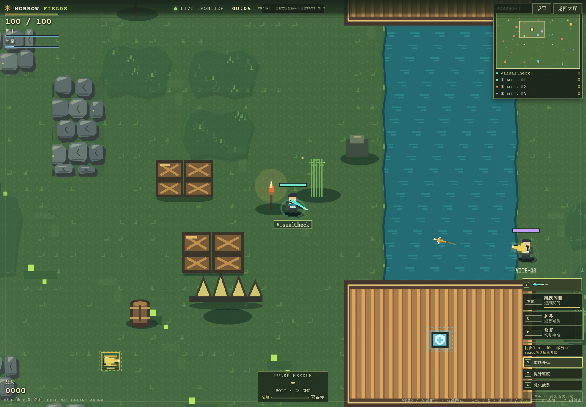

# Morrow Fields

[中文](#zh) · [English](#en)

<a id="zh"></a>

## 中文

Morrow Fields 是一款原创像素风俯视角在线竞技场游戏。玩家在森林、河流、桥梁和遗迹之间移动，拾取武器和补给，与其他玩家或机器人进行实时战斗。



### 游戏特色

- 三张地图：苔木林地、阳谷果园、赤叶遗迹。
- 六种模式：自由混战、感染乱斗、队伍积分、夺旗、五命决斗、感染生存。
- 15 种功能不同的武器，包括近距离武器、爆炸武器、追踪武器、能量光束和治疗武器。
- 地图中的武器、血包和护甲会在固定补给点生成，并在拾取后重新出现。
- 岩石、箱子、树木和尖刺会阻挡角色与弹道；草丛可以隐藏角色，但不会阻挡武器。
- 草丛中的玩家在同一片草丛内可以互相看见；开火或受到伤害后会暴露 3 秒。
- 导弹拥有像素爆炸、碎片、烟尘、屏幕闪光和镜头抖动效果。
- 支持房间码联机、机器人对手、旁观、房间聊天和短回放。
- 支持高 DPI 画布渲染，在高分辨率屏幕上保持清晰的像素画面。

### 地图

| 地图 | 环境 | 战术特点 |
| --- | --- | --- |
| Mosswood Crossing | 森林与纵向河流 | 桥梁、草丛和分散的掩体适合迂回和伏击 |
| Sunvale Orchard | 果园与横向河流 | 多条桥路连接两侧，适合争夺中央区域 |
| Redleaf Ruins | 赤色遗迹与浅滩 | 遗迹墙体、草丛和补给点形成多层交战路线 |

### 操作方式

| 操作 | 按键 |
| --- | --- |
| 移动 | `WASD` |
| 瞄准 / 射击 | 鼠标移动 / 鼠标左键 |
| 跳跃闪避 | 鼠标右键 |
| 护幕 | `Q` |
| 修复生命 | `E` |
| 装填 | `R` |
| 切换武器 | `1–0`、`N`、`M`、`H`、`J`、`L` |
| 蓄力瞄准 | `F` |
| 副射击 | `Y` |
| 选择升级 | `V`、`X`、`C`，然后按 `Space` 确认 |

### 本地运行

需要 Node.js 22+ 和 Python 3.13+。在项目目录执行：

```powershell
.\start-arena-local.ps1 -Build
```

然后打开 <http://127.0.0.1:8082/arena/>。停止游戏服务：

```powershell
.\stop-arena-local.ps1
```

### 浏览器测试

```powershell
npm run test:browser -- tests/arena.spec.ts
```

<a id="en"></a>

## English

Morrow Fields is an original pixel-art, top-down online arena game. Move through forests, rivers, bridges, and ruins, collect weapons and supplies, and fight other players or bots in real time.


### Features

- Three maps: Mosswood Crossing, Sunvale Orchard, and Redleaf Ruins.
- Six modes: Free-for-All, Infection Deathmatch, Team Deathmatch, Capture the Flag, Five-Life Duel, and Infection Survival.
- Fifteen weapons with different roles, including close-range weapons, explosives, seeker weapons, energy beams, and healing weapons.
- Weapons, health packs, and armor spawn at fixed supply points and return after pickup.
- Rocks, crates, trees, and spikes block players and projectiles; grass can hide players without blocking weapons.
- Players inside the same grass patch can see one another. Firing or taking damage reveals a hidden player for three seconds.
- Missiles use layered pixel explosions, debris, smoke, screen flashes, and camera shake.
- Room-code multiplayer, bot opponents, spectating, room chat, and short replays are supported.
- High-DPI canvas rendering keeps the pixel-art scene sharp on high-resolution displays.

### Maps

| Map | Environment | Tactical character |
| --- | --- | --- |
| Mosswood Crossing | Forest and a vertical river | Bridges, grass, and scattered cover support flanking and ambushes |
| Sunvale Orchard | Orchard and a horizontal river | Multiple bridges connect both sides and make the center contested |
| Redleaf Ruins | Red ruins and shallow crossings | Ruin walls, grass, and supply points create layered battle routes |

### Controls

| Action | Key |
| --- | --- |
| Move | `WASD` |
| Aim / Fire | Mouse movement / Left mouse button |
| Dash | Right mouse button |
| Shield | `Q` |
| Repair health | `E` |
| Reload | `R` |
| Switch weapon | `1–0`, `N`, `M`, `H`, `J`, `L` |
| Charge aim | `F` |
| Alternate fire | `Y` |
| Choose an upgrade | `V`, `X`, or `C`, then press `Space` to confirm |

### Run locally

Node.js 22+ and Python 3.13+ are required. From the project directory, run:

```powershell
.\start-arena-local.ps1 -Build
```

Open <http://127.0.0.1:8082/arena/> in a browser. Stop the local server with:

```powershell
.\stop-arena-local.ps1
```

### Browser tests

```powershell
npm run test:browser -- tests/arena.spec.ts
```
